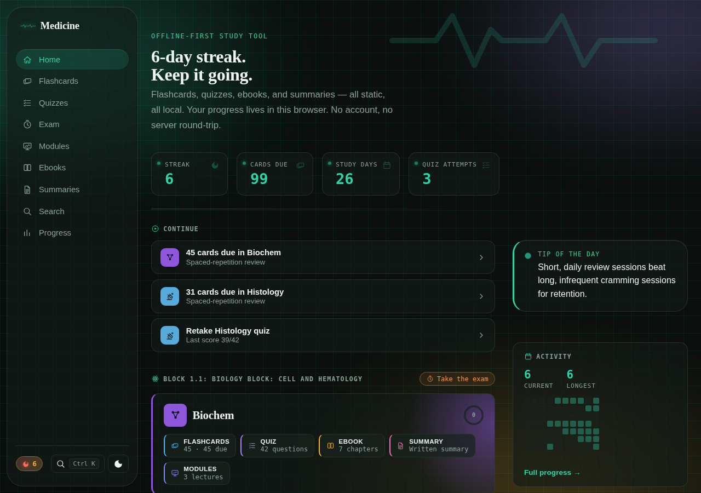
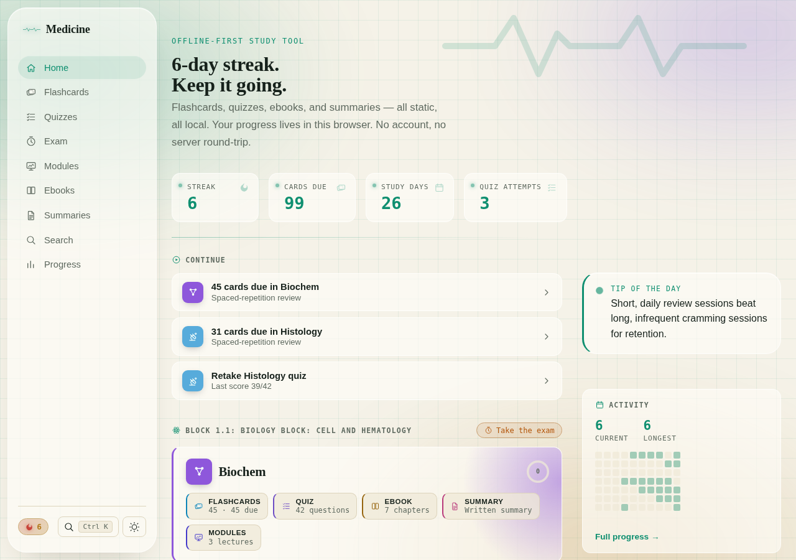
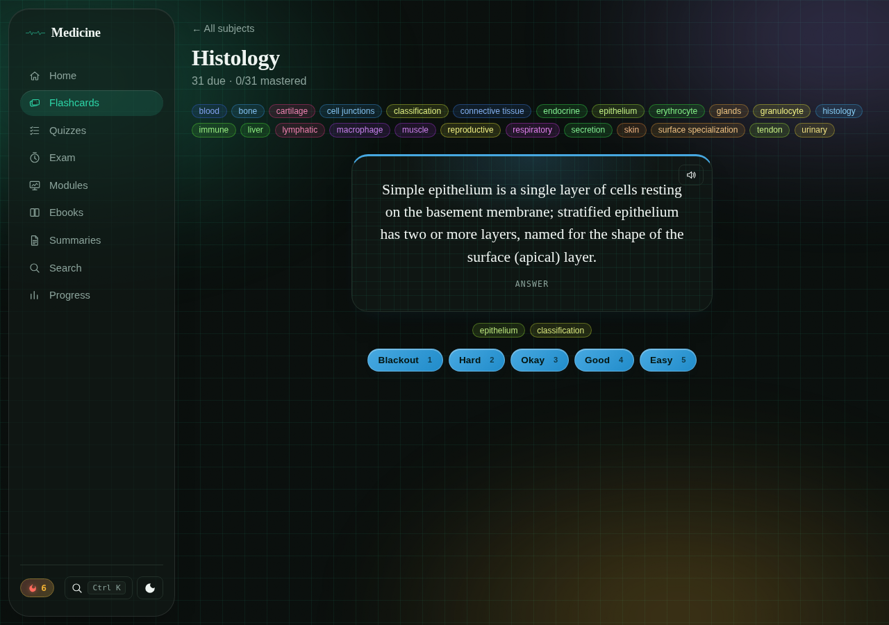
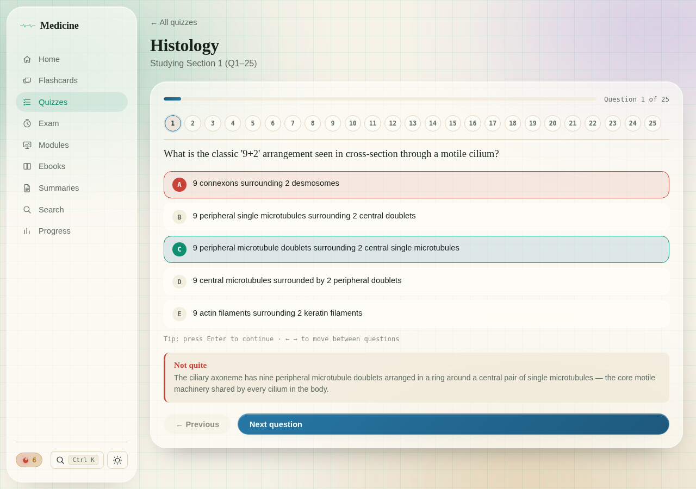
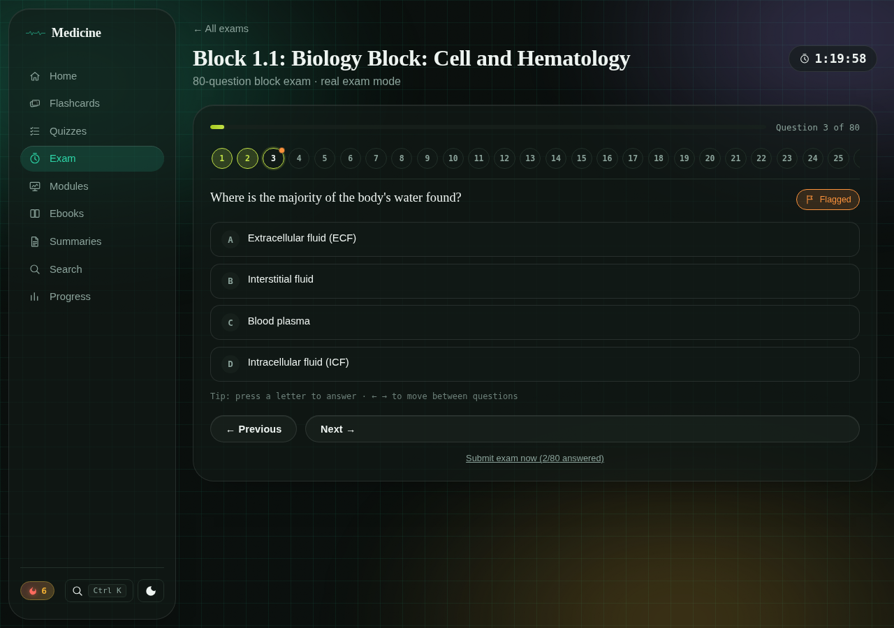
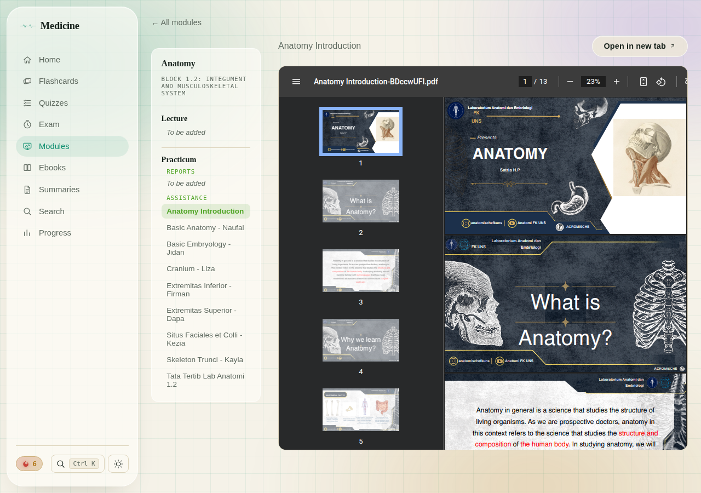
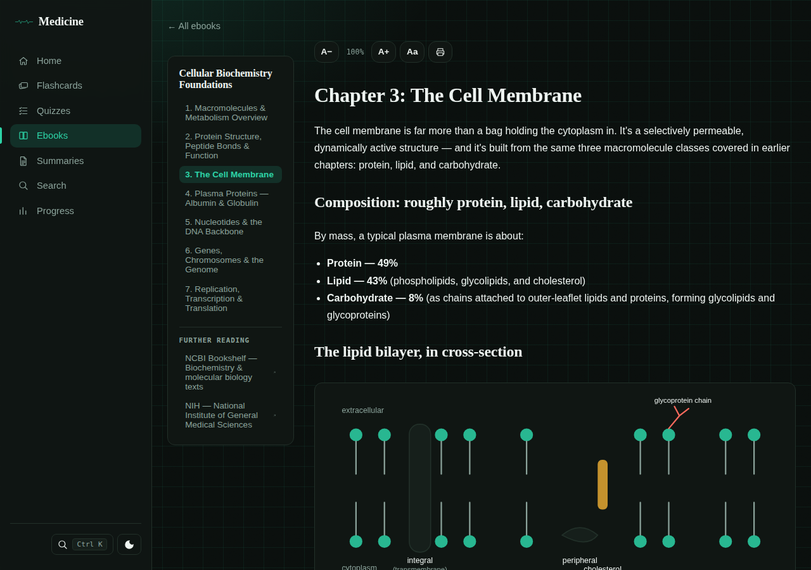
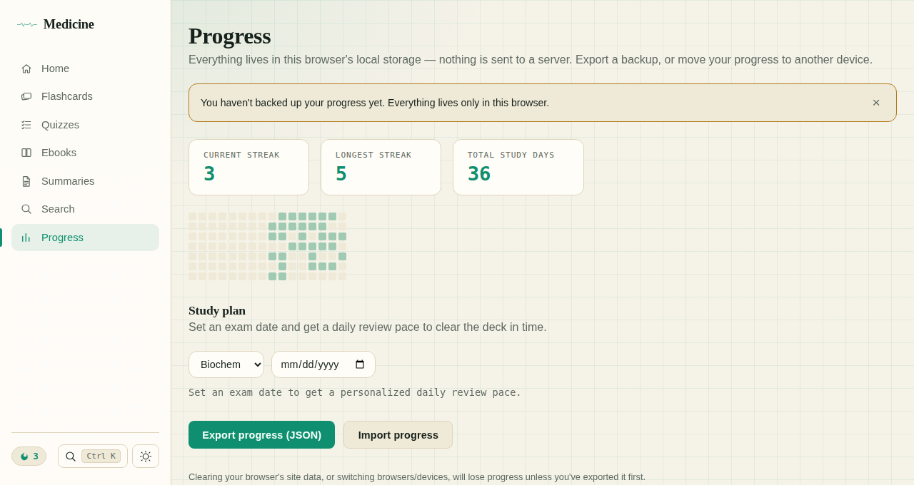

# Medicine — static study tool

[](./LICENSE)


A fully static, zero-backend study app for medical school, organized the way
the curriculum is: by **study block**, then by **subject**. Each subject can
have spaced-repetition flashcards, quizzes, chaptered ebooks, summaries and the
original lecture and practicum PDFs. Each block can have timed practice exams
built from past papers.

All content ships as JSON, Markdown and PDF files in the repo, and all progress
lives in the browser's `localStorage`. There are no accounts, no database and no
server round-trips. It installs as an offline-capable PWA and runs on any static
host, including Vercel's free tier.

## Screenshots

<table>
<tr>
<td width="50%">


**Home**: streak, due cards, what to continue, per-block subject cards

</td>
<td width="50%">


**Light theme**: follows the OS by default, toggle anytime

</td>
</tr>
<tr>
<td width="50%">


**Flashcards**: SM-2 review, tag filters, keyboard grading

</td>
<td width="50%">


**Quiz**: one question at a time, instant feedback with explanations

</td>
</tr>
<tr>
<td width="50%">


**Exam**: timed block exam, question navigator, flag for review

</td>
<td width="50%">


**Modules**: lecture and practicum PDFs, grouped by section

</td>
</tr>
</table>

<details>
<summary>Ebook chapter &amp; Progress page</summary>


**Ebook**: chapters with original diagrams, reading controls, further reading


**Progress**: streaks, activity heatmap, mastery by subject, study plan, backup

</details>

## What's inside

| Block | Subject | Content |
|---|---|---|
| **1.1**: Cell Biology and Hematology | Histology | 31 flashcards · 170 quiz questions · 5-chapter ebook · summary · 3 lecture PDFs |
| | Biochemistry | 45 flashcards · 42 quiz questions · 7-chapter ebook · summary · 3 lecture PDFs |
| | Physiology | 23 flashcards · 26 quiz questions · 4 lecture PDFs |
| | *Block exam* | 3 exam packages: Original Set (100 Q), Costraver (64 Q), UB 2025 (80 Q) |
| **1.2**: Integument and Musculoskeletal System | Anatomy | 7-chapter ebook (22 original diagrams, 153 slide figures) · 9 practicum assistance PDFs *(flashcards, quizzes and lectures coming)* |
| **1.3**: Digestive System and Metabolism | — | Coming soon |

## Features

**Flashcards**
- SM-2 spaced repetition with a due-card queue and a session summary
- Tag filtering (remembered per deck), with color-coded tag pills
- "Hardest cards" ranked by lapses, per deck and globally on the Progress page
- Optional card images and read-aloud (Web Speech API)

**Quizzes**
- One question at a time with instant feedback and an explanation for every answer
- A numbered navigator, previous/next, and full keyboard control
- Question and option order reshuffled on every attempt, so answers can't be memorized by position
- Banks over 50 questions split into about 25-question sections you can take one at a time
- An unfinished attempt resumes where you left off
- "Review missed only" retry, and a due queue where missed questions come back until you answer them correctly
- Score-trend sparkline, question images (micrographs and diagrams), and confetti on a perfect score

**Exam**
- Timed block exams: up to 100 questions at 1 minute each, scaled down for smaller banks
- A block can have several **exam packages** (e.g. past papers from different sources) to choose between. Without packages, the exam pools the block's quiz banks.
- **Real exam** mode (scored only at the end) or **instant feedback** mode
- Flag for review, a navigator showing answered and flagged questions, and a low-time warning
- Submitting with questions unanswered or flagged asks for confirmation first
- Review with explanations after submitting, a "retry missed" round, and score history per package

**Modules**
- The original lecture slides and practicum PDFs, viewable in-app with an "open in new tab" fallback
- Grouped as **Lecture**, then **Practicum** (Reports, Assistance), with empty sections marked "To be added"

**Ebooks and summaries**
- Chaptered Markdown with original inline SVG diagrams, a table of contents, and previous/next navigation
- Resume position and chapter-completion tracking
- Adjustable font size, an accessible-font toggle (Atkinson Hyperlegible), and print-friendly styling
- Optional PDFs and a "Further reading" list of external links

**Search and navigation**
- Fuzzy search (Fuse.js) across every flashcard, quiz question, summary section and ebook chapter, with type and subject filters
- A **⌘K / Ctrl+K** command palette to jump to any page or subject

**Progress**
- Study streaks, a GitHub-style activity heatmap, and mastery by subject (a card counts as mastered at a 21+ day interval)
- A study-plan generator: pick an exam date and get the daily review pace to clear the deck in time
- One-click export and import of all progress as a JSON file, plus a reminder if you haven't backed up in 14 days

**App**
- Installable PWA that works offline after the first visit (details in [Offline and updates](#offline-and-updates))
- Light and dark themes, with a color per content type and per subject
- Blocks with no content yet appear as "coming soon" placeholders
- A recovery screen instead of a blank page if saved progress from an older version breaks something

## Quick start

```bash
git clone https://github.com/neccrr/medicine.git
cd medicine
npm install
npm run dev       # http://localhost:5173
```

There are no environment variables, API keys or database to set up.

## Adding content

Everything under `/content` is discovered at build time with `import.meta.glob`
(see `src/lib/content.ts`). Adding a file is enough; you don't need to change
any code. Nothing is fetched at runtime.

```
content/
  flashcards/block/{blockId}/{subject}/deck.json       → Flashcard[]     { id, front, back, tags, image? }
  quizzes/block/{blockId}/{subject}/bank.json          → QuizQuestion[]  { id, question, options, answer, explanation, image? }
  quizzes/block/{blockId}/{subject}/*.html             → self-contained interactive quiz, embedded in an iframe
  exams/block/{blockId}/{packageId}/bank.json          → QuizQuestion[], one exam package
  exams/block/{blockId}/{packageId}/meta.json          → { name }, the package's display name
  ebooks/block/{blockId}/{subject}/meta.json           → { title, description, chapters: [{ id, title }], resources?: [{ title, url }] }
  ebooks/block/{blockId}/{subject}/chapter-NN.md       → Markdown chapter (inline <svg> diagrams allowed)
  ebooks/block/{blockId}/{subject}/*.pdf               → PDF shown alongside the chapters
  summaries/block/{blockId}/{subject}.md               → Markdown summary
  modules/block/{blockId}/{subject}/lecture/*.pdf              → lecturer slides
  modules/block/{blockId}/{subject}/practicum/reports/*.pdf    → practicum reports
  modules/block/{blockId}/{subject}/practicum/assistance/*.pdf → practicum assistance (asistensi) decks
  tips/tips.json                                       → string[], the tip of the day
```

### Blocks and subjects

Subjects are derived from folder names. Which subjects belong to which block,
and each block's display name, are set in `src/lib/blocks.ts`:

```ts
{ id: "1.2", label: "Block 1.2: Integument and Musculoskeletal System", subjectIds: ["anatomy"] }
```

`upcomingSubjects` in the same file adds "coming soon" cards for a subject
that's announced but has no content yet. A new block is a new entry in
`studyBlocks` plus its content folders.

### Quizzes and exams

- `image` is an optional HTML string rendered above the question. Use an ``
  pointing into `public/`, or an inline `<svg>` that uses the theme's CSS
  variables (e.g. `var(--accent)`) so it follows light and dark mode.
- A bank with more than 50 questions is split into sections automatically.
- A block with folders under `content/exams/block/{blockId}/` offers those
  packages on its Exam page. A block with no packages gets a pooled exam built
  from its subjects' quiz banks.

### Modules

A PDF placed directly in a subject's module folder (with no subfolder) is shown
in a plain list. Once a subject uses any section subfolder, the viewer shows
the full **Lecture / Practicum → Reports, Assistance** layout. Other subfolder
names also work and are listed after the standard sections.

Module and ebook PDFs are served as separate static files, never inlined into
the JavaScript bundle. They aren't downloaded upfront for offline use; each is
cached the first time it's opened.

> **Before adding PDFs from a course,** check them for personal data. Lab and
> class decks often include assistants' profiles, phone numbers, birth dates,
> or group invite links and QR codes. Remove those pages first: this repo is
> public, and the files are served as-is.

## Pages

| Route | What's there |
|---|---|
| `/` | Home: streak, stat tiles, "continue" list, tip of the day, per-block subject cards |
| `/flashcards` → `/flashcards/:blockId/:subjectId` | Subject list with due counts → SM-2 review session |
| `/quizzes` → `/quizzes/:blockId/:subjectId` | Subject list with last score and due counts → quiz (with section picker for large banks) |
| `/exam` → `/exam/:blockId[/:packageId]` | Block list → package picker → timed exam |
| `/modules` → `/modules/:blockId/:subjectId` | Subjects with PDFs → sectioned PDF viewer |
| `/ebooks` → `/ebooks/:blockId/:subjectId/:chapterId` | Book list with resume position → chapter reader |
| `/summaries` → `/summaries/:blockId/:subjectId` | Summary list → rendered summary |
| `/search` | Fuzzy search with type and subject filters |
| `/progress` | Streaks, heatmap, mastery, study plan, hardest cards, export/import |

Every page is code-split and loaded on demand.

## Keyboard shortcuts

| Where | Keys |
|---|---|
| Anywhere | **⌘K / Ctrl+K**: command palette |
| Flashcards | **Space / Enter**: flip · **1–5**: grade (Blackout → Easy) |
| Quiz | **A–E** or **1–5**: answer · **Enter / Space**: continue · **← →**: previous/next question |
| Exam | **A–E** or **1–5**: answer · **← →**: previous/next question |

## Offline and updates

- The service worker (vite-plugin-pwa / Workbox) precaches the app shell,
  styles, fonts and images, so the app loads with no connection after the
  first visit.
- PDFs are cached the first time you open them, which keeps the first visit
  fast even though the modules add up to about 300 MB.
- When a new version is deployed, the app checks for it on focus and every
  30 minutes, then shows a **"A new version is ready"** prompt. It never
  reloads on its own, so a quiz or exam in progress isn't lost.

## Project layout

```
src/
  pages/        one component per route (lazy-loaded)
  components/   sidebar, command palette, heatmap, badges, nudges, error boundary…
  hooks/        useSpacedRepetition, useQuizProgress, useExamHistory, useTheme,
                useReadingPrefs, useServiceWorkerUpdate, useLocalStorage…
  lib/          pure logic (each piece has a *.test.ts beside it)
  styles/       theme.css (design tokens) plus one stylesheet per area, imported by index.css
  types/        content.ts: Flashcard, QuizQuestion, ExamAttempt, EbookMeta…
```

Key modules in `src/lib`:

| File | Responsibility |
|---|---|
| `content.ts` | Discovers every content file at build time and exposes decks, banks, exam packages, ebooks, summaries and modules |
| `blocks.ts` | Block → subject mapping, "coming soon" subjects, grouping lists by block |
| `sm2.ts` | SM-2 scheduling: a 0–5 grade becomes the next interval, ease factor and due date |
| `quizScoring.ts` | Scores an attempt and keeps the "due for review" queue of missed questions |
| `quizShuffle.ts` | Per-attempt shuffle of question order and option order (answer index remapped) |
| `quizSections.ts` | Splits large banks into even sections |
| `examFormat.ts` | Exam length and time limit (100 questions max, 60 s each) |
| `moduleSections.ts` | Groups module PDFs into Lecture / Practicum sections |
| `searchIndex.ts` | Builds the Fuse.js index over all content |
| `textExtract.ts` | Strips Markdown, HTML and inline SVG down to searchable plain text |
| `activity.ts` | Study-day log, current and longest streaks |
| `studyPlan.ts` | Exam date plus deck stats becomes a daily review pace |
| `hardestCards.ts` | Ranks cards by lapses, then ease factor |
| `backupReminder.ts` | When to show the export reminder |
| `tipOfDay.ts` | Deterministic daily tip (same for everyone, no server) |
| `subjectStyle.ts` | Stable per-subject hue from the subject id, avoiding the red and green used for wrong/right |
| `storage.ts` | `localStorage` helpers and export/import of all `medicine:*` keys |

## Design

The look is **frosted glass over a clinical monitor**: translucent,
blurred panels float over slowly drifting color blobs, on a faint graph-paper
grid. An EKG pulse trace is the logo and hero decoration.

- **Type:** Fraunces (headings), Archivo (UI), IBM Plex Mono for anything that
  reads as data (counts, stats, badges, shortcut hints), and Atkinson
  Hyperlegible as the accessible reading font
- **Color:** a phosphor-teal accent; a fixed color per content type
  (flashcards, quizzes, exams, modules, ebooks, summaries); a hue per subject
  derived from its id
- **Theming:** all tokens live in `src/styles/theme.css`, with a dark default
  and a warm-paper light theme. Change the variables to retheme the app.
- **Accessibility:** skip-to-content link, visible focus outlines, ARIA roles
  on quiz options, toggles and timers, and `prefers-reduced-motion` respected
  by every animation

## Data and privacy

- Progress stays in this browser on this device. Use **Progress → Export** to
  back up, and **Import** to restore on another device.
- Content is the same for everyone. There are no accounts, per-user content,
  shared stats or leaderboards.
- Clearing site data erases progress. If saved progress from an older version
  ever breaks a page, the recovery screen offers **Reload** or **Clear local
  data and reload**.

## Development

```bash
npm run dev          # dev server on http://localhost:5173
npm run build        # type-check (tsc -b), build to dist/, generate the service worker
npm run preview      # serve the production build locally
npm run lint         # oxlint
npm run test         # vitest, single run
npm run test:watch   # vitest, watch mode
```

Tests cover the pure logic in `src/lib` (SM-2, scoring, shuffling, sections,
exam format, module grouping, blocks, streaks, search indexing, text
extraction, study plans, backup timing, tip of the day). There are no DOM or
component tests.

## Deploying

`vercel.json` sets the build command, the `dist` output directory, and an SPA
rewrite so deep links work on refresh. It also marks `sw.js`, the manifest and
`index.html` as `no-cache`, so a new deploy reaches installed copies promptly.
Import the repo in Vercel; it needs no environment variables or serverless
functions. Any static host with an SPA fallback to `index.html` works too, if it
sends the same no-cache headers for those three files.

## Contributing

- **Content** (flashcards, questions, chapters, summaries, PDFs) never needs a
  code change. Follow [Adding content](#adding-content), and read the
  personal-data note there before adding course PDFs.
- **Code:** keep pure logic in `src/lib` with a matching `*.test.ts`, and run
  the full check before opening a PR:

  ```bash
  npm run lint && npm run test && npm run build
  ```
- Open an issue first for changes to the data model (`src/types/content.ts`)
  or the content folder layout.

## License

The code and the original study material written for this app (flashcards,
quiz questions, ebook chapters, summaries, diagrams) are [MIT](./LICENSE)
licensed.

The PDFs under `content/modules/` are lecture and practicum materials from
their respective lecturers and lab assistants. They remain their authors'
work, are included only as study references, and are not covered by the MIT
license. The same applies to the slide figures under `public/ebook-figures/`,
which are cropped from those decks (many reproduce figures from published
anatomy atlases); each is captioned with its source deck and slide. To have a
file removed, open an issue.
