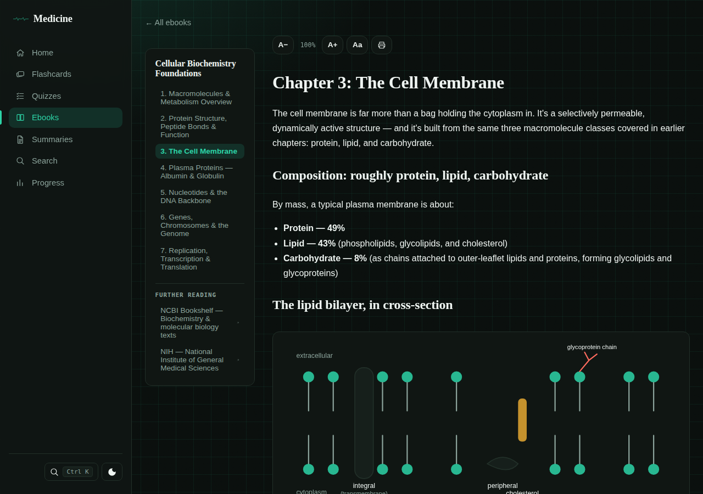
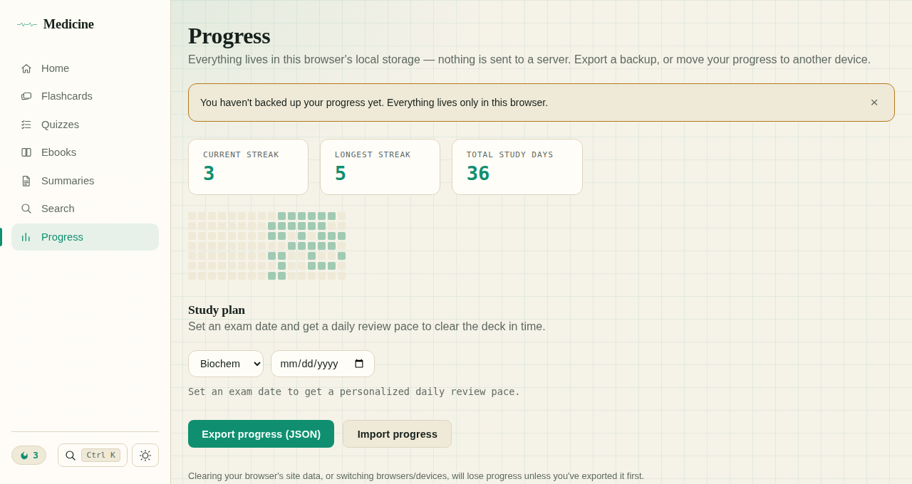

# Medicine: study tool

[](./LICENSE)


**Live:** [medicine.necr.help](https://medicine.necr.help)

A study app for medical school, organized the way
the curriculum is: by **study block**, then by **subject**. Each subject can
have spaced-repetition flashcards, quizzes, chaptered ebooks, summaries and the
original lecture and practicum PDFs. Each block can have timed practice exams
built from past papers.

All content ships as JSON, Markdown and PDF files in the repo, and progress
lives in the browser's `localStorage`, so it works with no sign-in, offline, as
a PWA. Optional **accounts** (email and password, or Google) sync that progress
across devices through one Vercel Function and MongoDB Atlas. Without the
account environment variables it runs as a plain static site.

## Screenshots

<table>
<tr>
<td width="50%">


**Home**: streak, due cards, what to continue, per-block subject cards

</td>
<td width="50%">


**Light theme**: follows the OS by default, toggle anytime

</td>
</tr>
<tr>
<td width="50%">


**Flashcards**: SM-2 review, tag filters, keyboard grading

</td>
<td width="50%">


**Quiz**: one question at a time, instant feedback with explanations

</td>
</tr>
<tr>
<td width="50%">


**Exam**: timed block exam, question navigator, flag for review

</td>
<td width="50%">


**Modules**: lecture and practicum PDFs, grouped by section

</td>
</tr>
</table>

<details>
<summary>Ebook chapter &amp; Progress page</summary>


**Ebook**: chapters with original diagrams, reading controls, further reading


**Progress**: streaks, activity heatmap, mastery by subject, study plan, backup

</details>

## What's inside

| Block | Subject | Content |
|---|---|---|
| **1.1**: Cell Biology and Hematology | Histology | 31 flashcards · 170 quiz questions · 5-chapter ebook · summary · 3 lecture PDFs |
| | Biochemistry | 45 flashcards · 42 quiz questions · 7-chapter ebook · summary · 3 lecture PDFs |
| | Physiology | 23 flashcards · 26 quiz questions · 4 lecture PDFs |
| | *Block exam* | 3 exam packages: Original Set (100 Q), Costraver (64 Q), UB 2025 (80 Q) |
| **1.2**: Integument and Musculoskeletal System | Anatomy | 144 flashcards · 986 image-occlusion labels on 88 figures · 134 quiz questions · 7-chapter ebook (22 original diagrams, 153 slide figures) · summary · 9 practicum assistance PDFs |
| | Physiology | 57 flashcards · 59 quiz questions · 5-chapter ebook on muscle contraction and reflexes (12 original diagrams, 41 slide figures) · summary · 3 practicum assistance PDFs |
| | *Block exam* | Pooled from the anatomy and physiology quiz banks (100 Q) |
| **1.3**: Digestive System and Metabolism | — | Coming soon |

## Features

**Flashcards**
- SM-2 spaced repetition with a due-card queue and a session summary
- Tag filtering (remembered per deck), with color-coded tag pills
- "Hardest cards" ranked by lapses, per deck and globally on the Progress page
- Optional card images and read-aloud (Web Speech API)

**Image Occlusion** (anatomy)
- Anki-style: atlas figures with their labels covered; name the one under the red box, reveal it, grade it. Every label has its own SM-2 schedule, with the next interval shown on each grade button
- Review (what's due) or Browse all (every figure in order): previous/next label and figure, tap any box or numbered chip to ask that label, swipe on phones
- Gallery of every figure with its progress, colour-coded label chips (new, due, learning, mastered), undo the last grade, show every label to study a figure whole, zoom, hide all or one, filter by region; picks up where you left off

**Explain this** (quizzes and flashcards)
- Shows the passages of the subject's own ebook and summary that match the question: free, instant, works offline
- Signed-in students can ask an AI to explain the answer (and why their pick was wrong), streamed in, grounded in those passages, with a daily allowance per student

**Quizzes**
- One question at a time with instant feedback and an explanation for every answer
- A numbered navigator, previous/next, and full keyboard control
- Question and option order reshuffled on every attempt, so answers can't be memorized by position
- Banks over 50 questions split into about 25-question sections you can take one at a time
- An unfinished attempt resumes where you left off
- "Review missed only" retry, and a due queue where missed questions come back until you answer them correctly
- Score-trend sparkline, question images (micrographs and diagrams), and confetti on a perfect score

**Exam**
- Timed block exams: up to 100 questions at 1 minute each, scaled down for smaller banks
- A block can have several **exam packages** (e.g. past papers from different sources) to choose between. Without packages, the exam pools the block's quiz banks.
- **Real exam** mode (scored only at the end) or **instant feedback** mode
- Flag for review, a navigator showing answered and flagged questions, and a low-time warning
- Submitting with questions unanswered or flagged asks for confirmation first
- Review with explanations after submitting, a "retry missed" round, and score history per package

**Modules**
- The original lecture slides and practicum PDFs, viewable in-app with an "open in new tab" fallback
- Grouped as **Lecture**, then **Practicum** (Reports, Assistance), with empty sections marked "To be added"

**Virtual Lab**
- A practice simulator for the PhysioEx 9.1 Exercise 2 (skeletal muscle) dry lab: all seven activities, from the twitch and latent period to the load–velocity relationship
- A muscle on a force transducer with an oscilloscope trace, voltage, length, stimulus rate and weight controls, and a **Measure** line for the latent period
- Summation, unfused and fused tetanus, fatigue with rest periods, length–tension (active, passive, total) and isotonic lifts, from one tested model (`src/lib/muscleSim.ts`) tuned to the practicum's numbers (threshold 0.8 V, maximal 8.5 V, 1.82 g twitch, optimal length 75 mm)
- **Record Data** into a table that is kept per activity, **Plot Data**, CSV download, and check questions with explanations

**Ebooks and summaries**
- Chaptered Markdown with original inline SVG diagrams, a table of contents, and previous/next navigation
- Resume position and chapter-completion tracking
- Adjustable font size, an accessible-font toggle (Atkinson Hyperlegible), and print-friendly styling
- Optional PDFs and a "Further reading" list of external links

**Search and navigation**
- Fuzzy search (Fuse.js) across every flashcard, quiz question, summary section and ebook chapter, with type and subject filters
- A **⌘K / Ctrl+K** command palette to jump to any page or subject
- A collapsible sidebar that shrinks to an icon rail on desktop (remembered between visits), giving pages such as the ebook reader a wider column

**Progress**
- Study streaks, a GitHub-style activity heatmap, and mastery by subject (a card counts as mastered at a 21+ day interval)
- A study-plan generator: pick an exam date and get the daily review pace to clear the deck in time
- One-click export and import of all progress as a JSON file, plus a reminder if you haven't backed up in 14 days

**Accounts (optional)**
- Guest mode by default: everything works without signing in
- Sign up with Google (one tap, with the account chooser) or email and password; profile with name and cohort
- Connect Google to a password account from the Account page; a Google sign-in never silently joins an unverified password account with the same email
- Clear messages when Google sign-in is cancelled or fails, and a hint to open the page in a real browser when it's inside an app (Instagram, LINE…) where Google blocks sign-in
- Flashcard reviews, quiz and exam history, reading progress, streak days and settings sync across devices, offline-first
- Guest progress is merged into the account on first sign-in (per-card, per-attempt, per-day, so nothing studied on either device is lost)
- Sign out keeps local progress; "sign out and clear" for shared computers; download all account data; delete the account
- A "current block" setting (guests too) that puts your block first on Home
- Opt-in **leaderboard**: this week, all time and study streak, for everyone or just your cohort. Points are worked out on the server from synced progress (1 per correct answer, 2 per learned flashcard, 10 per finished chapter, 5 per study day), and you choose the display name

**App**
- Installable PWA that works offline after the first visit (details in [Offline and updates](#offline-and-updates))
- Light and dark themes, with a color per content type and per subject
- Blocks with no content yet appear as "coming soon" placeholders
- A recovery screen instead of a blank page if saved progress from an older version breaks something

## Quick start

```bash
git clone https://github.com/neccrr/medicine.git
cd medicine
npm install
npm run dev       # http://localhost:5173
```

That runs the guest-only app; nothing else is needed. To try accounts
locally, run `npm run dev:api` instead: it serves the real API from the Vite dev
server with in-memory storage (or your database, if `MONGODB_URI` is set).

## Adding content

Everything under `/content` is discovered at build time with `import.meta.glob`
(see `src/lib/content.ts`). Adding a file is enough; you don't need to change
any code. Nothing is fetched at runtime.

```
content/
  flashcards/block/{blockId}/{subject}/deck.json       → Flashcard[]     { id, front, back, tags, image? }
  occlusion/block/{blockId}/{subject}/notes.json       → OcclusionNote[] { id, image, width, height, title, region, chapter, masks: [{ id, x, y, w, h, label }] }
  quizzes/block/{blockId}/{subject}/bank.json          → QuizQuestion[]  { id, question, options, answer, explanation, image? }
  quizzes/block/{blockId}/{subject}/*.html             → self-contained interactive quiz, embedded in an iframe
  exams/block/{blockId}/{packageId}/bank.json          → QuizQuestion[], one exam package
  exams/block/{blockId}/{packageId}/meta.json          → { name }, the package's display name
  ebooks/block/{blockId}/{subject}/meta.json           → { title, description, chapters: [{ id, title }], resources?: [{ title, url }] }
  ebooks/block/{blockId}/{subject}/chapter-NN.md       → Markdown chapter (inline <svg> diagrams allowed)
  ebooks/block/{blockId}/{subject}/*.pdf               → PDF shown alongside the chapters
  summaries/block/{blockId}/{subject}.md               → Markdown summary
  modules/block/{blockId}/{subject}/lecture/*.pdf              → lecturer slides
  modules/block/{blockId}/{subject}/practicum/reports/*.pdf    → practicum reports
  modules/block/{blockId}/{subject}/practicum/assistance/*.pdf → practicum assistance (asistensi) decks
  tips/tips.json                                       → string[], the tip of the day
```

### Blocks and subjects

Subjects and their blocks are both derived from folder paths: a file under
`content/{type}/block/1.2/physiology/` belongs to physiology in Block 1.2. The
same subject can therefore appear in more than one block (physiology is in
both 1.1 and 1.2), each with its own card. `src/lib/blocks.ts` holds only
each block's display name:

```ts
{ id: "1.2", label: "Block 1.2: Integument and Musculoskeletal System" }
```

`upcomingSubjects` in the same file adds "coming soon" cards for a subject
that's announced but has no content yet. A new block is a new entry in
`studyBlocks` plus its content folders.

Every content map and every progress entry in localStorage is keyed by
`{blockId}/{subjectId}` (`subjectKey` in `src/lib/content.ts`), so 1.1 and 1.2
physiology keep separate decks, quizzes and progress. Progress saved by older
versions under the bare subject id is renamed on startup (and after importing
an old backup) by `src/lib/progressMigration.ts`. Flashcard and quiz-question
ids must be unique across all decks; `src/lib/contentIntegrity.test.ts` checks
this.

### Quizzes and exams

- `image` is an optional HTML string rendered above the question. Use an ``
  pointing into `public/`, or an inline `<svg>` that uses the theme's CSS
  variables (e.g. `var(--accent)`) so it follows light and dark mode. An ``
  can be tapped to open it full screen. Wrap labelled diagrams in
  `<div class="quiz-photo-diagram quiz-diagram-wide" style="aspect-ratio: W / H;">`
  so they use the full card width on a white background.
- A bank with more than 50 questions is split into sections automatically.
- A block with folders under `content/exams/block/{blockId}/` offers those
  packages on its Exam page. A block with no packages gets a pooled exam built
  from its subjects' quiz banks.

### Modules

A PDF placed directly in a subject's module folder (with no subfolder) is shown
in a plain list. Once a subject uses any section subfolder, the viewer shows
the full **Lecture / Practicum → Reports, Assistance** layout. Other subfolder
names also work and are listed after the standard sections.

Module and ebook PDFs are served as separate static files, never inlined into
the JavaScript bundle. They aren't downloaded upfront for offline use; each is
cached the first time it's opened.

> **Before adding PDFs from a course,** check them for personal data. Lab and
> class decks often include assistants' profiles, phone numbers, birth dates,
> or group invite links and QR codes. Remove those pages first: this repo is
> public, and the files are served as-is.

## Pages

| Route | What's there |
|---|---|
| `/` | Home: streak, stat tiles, "continue" list, tip of the day, per-block subject cards |
| `/subjects` → `/subjects/:blockId/:subjectId` | Every subject → its page: cover, what's due next, every section, chapters and labs |
| `/flashcards` → `/flashcards/:blockId/:subjectId` | Subject list with due counts → SM-2 review session |
| `/occlusion` → `/occlusion/:blockId/:subjectId` | Subjects with figures → image occlusion (review or browse, figure gallery) |
| `/quizzes` → `/quizzes/:blockId/:subjectId` | Subject list with last score and due counts → quiz (with section picker for large banks) |
| `/exam` → `/exam/:blockId[/:packageId]` | Block list → package picker → timed exam |
| `/modules` → `/modules/:blockId/:subjectId` | Subjects with PDFs → sectioned PDF viewer |
| `/ebooks` → `/ebooks/:blockId/:subjectId/:chapterId` | Book list with resume position → chapter reader |
| `/summaries` → `/summaries/:blockId/:subjectId` | Summary list → rendered summary |
| `/lab` → `/lab/:exerciseId/:activity` | Virtual Lab activities → simulator bench, data table, plot and check questions |
| `/search` | Fuzzy search with type and subject filters |
| `/progress` | Streaks, heatmap, mastery, study plan, hardest cards, export/import |
| `/leaderboard` | Weekly, all-time and streak rankings, filtered to your cohort; join or leave, and pick a display name (signed-in only) |
| `/account` | Sign in or create an account; profile, sync status, current block, sign out, data download, account deletion |

Every page is code-split and loaded on demand.

## Keyboard shortcuts

| Where | Keys |
|---|---|
| Anywhere | **⌘K / Ctrl+K**: command palette |
| Anywhere (desktop) | **⌘\\ / Ctrl+\\**: collapse or expand the sidebar |
| Flashcards | **Space / Enter**: flip · **1–5**: grade (Blackout → Easy) |
| Image occlusion | **Space**: reveal · **1–5**: grade · **← →**: previous/next label · **Shift+← →** or **[ ]**: previous/next figure · **G**: gallery · **A**: show all labels · **H**: hide all / one · **Z**: zoom · **U** or **Ctrl+Z**: undo |
| Quiz | **A–E** or **1–5**: answer · **Enter / Space**: continue · **← →**: previous/next question |
| Exam | **A–E** or **1–5**: answer · **← →**: previous/next question |

## Offline and updates

- The service worker (vite-plugin-pwa / Workbox) precaches the app shell,
  styles, fonts and images, so the app loads with no connection after the
  first visit.
- PDFs are cached the first time you open them, which keeps the first visit
  fast even though the modules add up to about 300 MB.
- When a new version is deployed, the app checks for it on focus and every
  30 minutes, then shows a **"A new version is ready"** prompt. It never
  reloads on its own, so a quiz or exam in progress isn't lost.

## Project layout

```
src/
  pages/        one component per route (lazy-loaded)
  components/   sidebar, command palette, heatmap, badges, nudges, error boundary…
  hooks/        useSpacedRepetition, useQuizProgress, useExamHistory, useTheme,
                useReadingPrefs, useServiceWorkerUpdate, useLocalStorage…
  lib/          pure logic (each piece has a *.test.ts beside it)
  styles/       theme.css (design tokens) plus one stylesheet per area, imported by index.css
  types/        content.ts: Flashcard, QuizQuestion, ExamAttempt, EbookMeta…
  context/      AccountContext: session, sync scheduling, sign-in actions
api/
  index.ts      the Vercel Function; vercel.json rewrites /api/* here
server/         the API behind it:
  app.ts          routes: auth (Better Auth), config, sync, export, leaderboard
  schema.ts       every MongoDB collection and its indexes, created once per cold start
  progressStore.ts  synced progress, one document per user per key (MongoDB and in-memory)
  leaderboard.ts  scoring and ranking, one document per user (MongoDB and in-memory)
  mongo.ts        the shared client; devApi.ts serves the API from the Vite dev server
```

### Storage

Progress lives in the browser's `localStorage` as `medicine:{type}` or
`medicine:{type}:{id}` keys. `src/lib/storageSchema.ts` declares every type in
one table: what its id is, whether it syncs and which merge rule applies,
whether it survives "sign out and clear". The storage helpers, the sync engine,
the legacy-key migration and the server's scoring all read that table, so a new
kind of progress is added in one place.

With an account, each synced key is one MongoDB document (`progress`), indexed
by user and key for merges and by user and revision for "what changed since my
last sync". The leaderboard keeps one small document per student with a score
part per scoring key. A sync rescores only the keys it wrote, as separate field
updates, so it never re-reads a student's whole history and two syncs at once
can't overwrite each other. Expired sessions and verification tokens are
deleted by MongoDB TTL indexes.

Key modules in `src/lib`:

| File | Responsibility |
|---|---|
| `content.ts` | Discovers every content file at build time and exposes decks, banks, exam packages, ebooks, summaries and modules |
| `blocks.ts` | Block display names, "coming soon" subjects, grouping lists by block |
| `sm2.ts` | SM-2 scheduling: a 0–5 grade becomes the next interval, ease factor and due date |
| `quizScoring.ts` | Scores an attempt and keeps the "due for review" queue of missed questions |
| `quizShuffle.ts` | Per-attempt shuffle of question order and option order (answer index remapped) |
| `quizSections.ts` | Splits large banks into even sections |
| `examFormat.ts` | Exam length and time limit (100 questions max, 60 s each) |
| `moduleSections.ts` | Groups module PDFs into Lecture / Practicum sections |
| `searchIndex.ts` | Builds the Fuse.js index over all content |
| `textExtract.ts` | Strips Markdown, HTML and inline SVG down to searchable plain text |
| `activity.ts` | Study-day log, current and longest streaks |
| `studyPlan.ts` | Exam date plus deck stats becomes a daily review pace |
| `hardestCards.ts` | Ranks cards by lapses, then ease factor |
| `backupReminder.ts` | When to show the export reminder |
| `tipOfDay.ts` | Deterministic daily tip (same for everyone, no server) |
| `subjectStyle.ts` | Stable per-subject hue from the subject id, avoiding the red and green used for wrong/right |
| `storageSchema.ts` | The registry of every `localStorage` key type: id, sync and merge rule, clearing (shared with the server) |
| `routeMeta.ts` | Title, description, breadcrumbs and indexability for every route (the app and the prerendered pages) |
| `storage.ts` | `localStorage` helpers, the key builders, and export/import of all `medicine:*` keys |
| `progressMigration.ts` | Renames progress saved under old subject-only keys to per-block keys |
| `syncMerge.ts` | How two copies of one key are merged, by the key's rule in the registry (shared with the server) |
| `sync.ts` | The sync round: upload changed keys, download the account's changes, apply them safely |
| `syncDirty.ts` | Records which synced keys changed on this device since the last sync |

## Design

The look is **frosted glass over a clinical monitor**: translucent,
blurred panels float over slowly drifting color blobs, on a faint graph-paper
grid. An EKG pulse trace is the logo and hero decoration.

- **Type:** Fraunces (headings), Archivo (UI), IBM Plex Mono for anything that
  reads as data (counts, stats, badges, shortcut hints), and Atkinson
  Hyperlegible as the accessible reading font
- **Color:** a phosphor-teal accent; a fixed color per content type
  (flashcards, quizzes, exams, modules, ebooks, summaries); a hue per subject
  derived from its id
- **Theming:** all tokens live in `src/styles/theme.css`, with a dark default
  and a warm-paper light theme. Change the variables to retheme the app.
- **Accessibility:** skip-to-content link, visible focus outlines, ARIA roles
  on quiz options, toggles and timers, and `prefers-reduced-motion` respected
  by every animation

## Data and privacy

- As a guest, progress stays in this browser on this device. Use **Progress →
  Export** to back up, and **Import** to restore on another device.
- With an account, the same `medicine:*` progress keys (not theme, sidebar
  state or half-finished quizzes) are stored in MongoDB under your user id,
  plus your name, email, optional cohort and a hashed password. Nothing is
  shared with other users unless you join the leaderboard, which shows your
  chosen display name, cohort and scores to other signed-in students (never
  your email or answers). Leave it any time. **Account → Download my data** exports it all, and
  **Delete account** removes the account and its stored progress.
- The public [Privacy Policy](https://medicine.necr.help/privacy) and
  [Terms of Service](https://medicine.necr.help/terms) are static pages in
  `public/legal/`, served at `/privacy` and `/terms` (the old `.html` addresses
  redirect there); update them if what the app stores changes.
- Content is the same for everyone.
- Clearing site data erases progress. If saved progress from an older version
  ever breaks a page, the recovery screen offers **Reload** or **Clear local
  data and reload**.

## Development

```bash
npm run dev          # dev server on http://localhost:5173 (guest-only)
npm run dev:api      # same, plus the account API with in-memory storage
npm run build        # type-check (tsc -b), build to dist/, generate the service worker
npm run preview      # serve the production build locally
npm run lint         # oxlint
npm run test         # vitest, single run
npm run test:watch   # vitest, watch mode
```

Tests cover the pure logic in `src/lib` (SM-2, scoring, shuffling, sections,
exam format, module grouping, blocks, streaks, search indexing, text
extraction, study plans, backup timing, tip of the day, sync merging) and the
API in `server/`: sign-up, sync, per-user isolation, validation, export and
deletion, leaderboard scoring and ranking, plus a two-device sync run of the
browser engine against the real handler. There are no DOM or component tests.

The MongoDB stores and indexes have an integration test that runs against a
real server when `MONGODB_TEST_URI` is set, using a throwaway database:

```bash
MONGODB_TEST_URI="mongodb://127.0.0.1:27017/?replicaSet=rs0" npx vitest run server/mongo.integration.test.ts
```

Better Auth uses transactions, so a local MongoDB for `npm run dev:api` with
`MONGODB_URI` must run as a replica set (a single node is fine); Atlas always is.

## Deploying

`vercel.json` sets the build command, the `dist` output directory, the
function region (`sin1`, Singapore, next to the Atlas cluster; change both
together if you move either), a rewrite
of `/api/*` to the API function, and an SPA rewrite so deep links work on
refresh. It also marks `sw.js`, the manifest and `index.html` as `no-cache`, so
a new deploy reaches installed copies promptly.

Without environment variables the app deploys as guest-only. To turn on
accounts (see `.env.example`):

1. In MongoDB Atlas, create a database user with **readWrite** on the
   `medicine` database only, and allow network access from Vercel: either
   `0.0.0.0/0` (the database user's password is then the protection) or the
   Vercel ↔ Atlas integration.
2. In Vercel → Settings → Environment Variables, set `MONGODB_URI`,
   `BETTER_AUTH_SECRET` (`openssl rand -base64 32`) and `BETTER_AUTH_URL`
   (`https://medicine.necr.help`).
3. Redeploy. `/api/config` answering `{"accounts":true,...}` means it worked.

### AI explanations (optional, free tier)

"Ask AI to explain" calls any OpenAI-compatible gateway from the server; the
site is set up for [NaraRouter](https://bynara.id/) and its free daily
allowance. In Vercel → Environment Variables (never in the repo):

- `AI_BASE_URL`: the gateway's OpenAI-compatible address from its API docs,
  up to and including `/v1` (`/chat/completions` is added)
- `AI_API_KEY`: your NaraRouter API key
- `AI_MODEL`: a model id from its model list (a free one). List backups after it,
  comma-separated (`fast-model,backup-model`); a model that fails or doesn't start
  answering within a minute hands over to the next
- `AI_DAILY_LIMIT` (optional): explanations per student per day, default 30

Redeploy; `/api/config` then answers `"ai":true` and the button appears for
signed-in students. Without these variables the button stays hidden and
"Explain this" shows only the matching passages from the notes.

### Search engines

`npm run build` ends with `scripts/prerender.mjs`, which writes a static page for
every public route into `dist/`: its own title, description, canonical URL and
breadcrumbs, with the content itself (card fronts, quiz questions, full ebook
chapters and summaries) as plain HTML. Past exam papers are listed by name only.
`vercel.json` serves those pages directly, so search engines don't have to run
the app to read them, and people get the app as usual (React replaces the static
content on start). The same step writes `sitemap.xml`, `robots.txt` (which keeps
the API, lecture PDFs, slide figures and past-paper images out of search) and
`404.html`. Titles and descriptions come from `src/lib/routeMeta.ts`, which the
app also uses to update the page title while you navigate. Personal pages
(progress, account, leaderboard, search) are `noindex`, and preview deployments
on `*.vercel.app` send `X-Robots-Tag: noindex`.

To get indexed:

1. In [Google Search Console](https://search.google.com/search-console), add a
   **Domain** property for `necr.help` and verify it with the DNS TXT record it
   shows you (at your domain registrar). Alternatively add a URL-prefix property
   for `https://medicine.necr.help`, choose the **HTML tag** method, and put the
   token (the `content` value only) in Vercel as `GOOGLE_SITE_VERIFICATION`, then
   redeploy.
2. **Sitemaps**: submit `https://medicine.necr.help/sitemap.xml`.
3. **URL inspection**: inspect the home page and a chapter page, and **Request
   indexing**.

### Google sign-in

1. In the [Google Cloud console](https://console.cloud.google.com/), create a
   project, then open **Google Auth Platform** and **Get started**: app name
   "Medicine", your support email, audience **External**.
2. **Branding**: home page `https://medicine.necr.help`, privacy policy
   `https://medicine.necr.help/privacy`, terms of service
   `https://medicine.necr.help/terms`, authorized domain `necr.help`. Skip
   the logo (uploading one starts a Google review).
3. **Audience**: **Publish app**. While it's in "Testing", only listed test
   users can sign in. The app asks only for name, email and profile picture, so
   publishing needs no review.
4. **Clients → Create client → Web application**:
   - Authorized JavaScript origin: `https://medicine.necr.help`
   - Authorized redirect URI: `https://medicine.necr.help/api/auth/callback/google`
5. Copy the client ID and secret into Vercel as `GOOGLE_CLIENT_ID` and
   `GOOGLE_CLIENT_SECRET`, and redeploy. `/api/config` then answers
   `"google":true` and the button appears.

Google doesn't accept wildcard redirect URIs, so preview deployments on
`*.vercel.app` can't use Google sign-in unless you add their exact callback
URL. For local testing, add `http://localhost:5173` and
`http://localhost:5173/api/auth/callback/google` to the client and run
`npm run dev:api` with both variables set.

The link-preview tags in `index.html` (Open Graph, Twitter) point at
`https://medicine.necr.help`. A fork deployed elsewhere sets `SITE_URL` at build
time.

Collections and indexes (listed in `server/schema.ts`) are created
automatically. Any static host with an SPA
fallback works for guest-only mode, if it sends the same no-cache headers.

## Contributing

- **Content** (flashcards, questions, chapters, summaries, PDFs) never needs a
  code change. Follow [Adding content](#adding-content), and read the
  personal-data note there before adding course PDFs.
- **Code:** keep pure logic in `src/lib` with a matching `*.test.ts`, and run
  the full check before opening a PR:

  ```bash
  npm run lint && npm run test && npm run build
  ```
- Open an issue first for changes to the data model (`src/types/content.ts`)
  or the content folder layout.

## License

The code and the original study material written for this app (flashcards,
quiz questions, ebook chapters, summaries, diagrams) are [MIT](./LICENSE)
licensed.

The PDFs under `content/modules/` are lecture and practicum materials from
their respective lecturers and lab assistants. They remain their authors'
work, are included only as study references, and are not covered by the MIT
license. The same applies to the slide figures under `public/ebook-figures/`,
which are cropped from those decks (many reproduce figures from published
atlases and textbooks); each is captioned with its source deck and slide. The
anatomy quiz figures in `public/ebook-figures/anatomy-quiz/` come from the same
decks, some with labels covered by a "?" so the figure doesn't give the answer
away. To have a file removed, open an issue.
